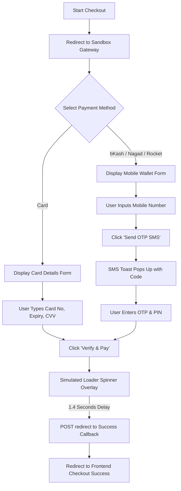

# Apex E-Commerce Platform - Technical Documentation

This document provides a highly detailed overview of the design, architecture, database models, background services, frontend systems, and custom configurations implemented for the **Apex E-Commerce Platform** (formerly MERN E-Commerce).

---

## 1. Project Goal & Design Style

The goal of this project was to build a full-stack, production-ready e-commerce platform using clean, structured code, modern UI aesthetics, and comprehensive functionality.

### Key Visual Guidelines
* **Glassmorphism**: UI surfaces feature dark translucent backgrounds (`rgba(17, 24, 39, 0.85)`) with high-blur backdrops (`backdrop-filter: blur(16px)`) and subtle border lines.
* **Slate/Neon Colors**: Utilizes a premium color palette with dark slate gray backgrounds, indigo brand accents (`#6366f1`), teal success states (`#10b981`), and red warnings (`#f43f5e`).
* **Micro-Animations**: Clean animations for card hover scales, modal fade-ins, and button glows to create a premium, responsive feel.
* **Harmonious Typography**: Employs *Plus Jakarta Sans* as the primary typeface for a modern and clean display.

---

## 2. Backend Architecture (MVC Pattern)

The backend is built in **Node.js + Express** using native **ES Modules** (`import/export` syntax). Data validation and database schemas map directly to MongoDB using **Mongoose**.

### 2.1 Database Models (`backend/models/`)
The database contains **16 structured schemas** to model all e-commerce operations:
1. **User.js**: Manages user profiles (admin vs customer roles), email authentication, verification states, and 2FA OTP codes.
2. **Address.js**: Stores multiple physical shipping/billing address records linked to a user.
3. **Product.js**: Defines inventory parameters (SKU, brand, category, tags, specs, pricing, original price, discount price, and stock levels).
4. **Category.js**: Catalog taxonomy for categories (e.g. Electronics, Clothing).
5. **Brand.js**: Brand records, containing names, descriptions, and logo URLs.
6. **Review.js**: Customer feedback linked to products, including a purchase validation flag so only verified buyers can review products.
7. **Cart.js**: Persists active items, quantities, and coupon bindings.
8. **Wishlist.js**: Bookmarks items to buy later.
9. **Order.js**: Records checkout transactions, line items, shipping address details, and payment metrics.
10. **Invoice.js**: Linked order invoice documents, tracking the generated PDF's disk path.
11. **Coupon.js**: Sets up promotion coupons (flat discount value or percentage, limits, expiration).
12. **Campaign.js**: Promotional landing page configurations (banners, custom themes, discount overrides).
13. **Banner.js**: Hero banners for the homepage slider.
14. **Notification.js**: Real-time customer alerts (order confirmations, delivery status updates, payment reviews).
15. **ActivityLog.js**: Detailed audit logging of user operations (e.g. logins, address deletions, order placements) for security analysis.
16. **Payment.js**: Transaction log records received from payment gateways.

### 2.2 Controllers & API Routes
Controllers isolate business logic from network requests. Standard REST routes expose these methods:
* **Auth**: Coordinates JWT generation, sign-up flows, email token links, and 2-Step Login OTP generation/validation.
* **Orders**: Handles stock deductions, coupon validation checks, tax math, order creation, and database logging.
* **Dashboard (Admin)**: Resolves monthly earnings, order volumes, inventory alerts, and prepares data for dashboard visual curves.

---

## 3. Custom Backend Services & Engines

Specialized services are isolated in `backend/services/` to keep controllers clean:

### 3.1 Pricing Recommendation Engine (`pricingService.js`)
An automated pricing recommendation engine dynamically calculates suggested retail values for products based on six variables:
* **Competitor Pricing**: Scans and averages competitor entries for similar SKUs.
* **Category Profit Targets**: Applies profit multipliers defined by category margins.
* **Brand Value Coefficients**: Adjusts price points depending on brand premium indexes.
* **Demand Multiplier**: Increases recommendations based on sales volume thresholds.
* **Feature Indexes**: Analyzes text specifications to assess premiums for premium build parameters.
* **Seasonal Adjustment**: Evaluates active seasonal sales campaigns.

### 3.2 Dynamic Invoice PDF Service (`pdfService.js`)
When an order is confirmed, the invoice service dynamically renders a professional PDF invoice using `pdfkit`. The invoice is saved to disk and can be downloaded by the customer. It contains:
* Indigo branding banner with the company logo.
* Standard A4 layout grid structure.
* Detailed metadata column (Invoice No, Order Date, Payment status/method).
* Customer shipping details panel.
* Clean itemized table listing product name, quantity, individual prices, product-level discounts, and subtotal lines.
* Final cost breakdown: Subtotal, Catalog discount, Coupon reduction, Tax (15%), Shipping, and Grand Total.

### 3.3 NodeMailer Email Service (`emailService.js`)
Sends dynamic HTML transactional emails for:
* E-mail verification links.
* 6-digit OTP codes for secure 2FA login.
* Order confirmations with PDF attachments.
* **Mock Logger Fallback**: If no SMTP environment credentials are configured, the service logs plain-text fallback strings directly to the backend development console. This lists the OTP codes immediately, allowing developers to test 2FA features out-of-the-box without key setups.

---

## 4. Upgraded Interactive Payment Gateway Sandbox

The mock gateway endpoint (`/api/payments/mock-gateway`) simulates a live merchant processing page. We upgraded this page from a static checkout layout to a fully interactive, high-fidelity experience:



### Gateway Sandbox Highlights
* **Tab-Based Exchanger**: Toggles between Card, bKash, Nagad, and Rocket options, loading corresponding inputs dynamically.
* **Brand Colors**: Adapts the page accents and gradient glows dynamically (bKash Pink, Nagad Orange, Rocket Purple, Card Indigo) as you click methods.
* **Input Validation & Formatting**:
  * Form inputs use digit-only JS filters to block letters.
  * Formats card numbers (`XXXX XXXX XXXX XXXX`) and expiration slashes (`MM/YY`) automatically as you type.
  * Pattern attributes match exact card lengths, Bangladeshi mobile structures (`01[3-9]\d{8}`), and PIN lengths.
* **Mock OTP SMS Toast**: Clicking "Send OTP SMS" generates a random 6-digit passcode and pops up an alert toast containing the OTP, which is auto-filled for testing.
* **Control Alignment Spacer**: Solved a design issue where the PIN input and the "Send OTP SMS" button were vertically misaligned due to label differences. We added a matching `visibility: hidden` spacer label above the OTP button so they share the same spacing structure.
* **Secure Loader Overlay**: Intercepts form submission and renders a loading spinner walk-through for 1.4 seconds to simulate payment processing before redirecting.

---

## 5. Frontend Architecture (React + Vite)

The frontend client compiles via **Vite** and implements hot-reloading development servers.

### 5.1 Context State Management (`frontend/src/context/`)
* **AuthContext.jsx**: Handles login, logout, verification status, and saves the JWT to `localStorage` (allowing auto-login on refresh).
* **CartContext.jsx**: Coordinates cart additions, updates, deletions, coupon checking, saving items for later, and computes shipping costs (free over $100) and tax globally.
* **WishlistContext.jsx**: Manages wishlist arrays and synchronizes bookmark states.

### 5.2 Interactive UI Improvements
* **Navbar Click-Outside Close**: Configured React `useRef` bindings and a document mouse-down event listener in [Navbar.jsx](file:///home/shiku/ecommerce/frontend/src/components/Navbar.jsx) to automatically close the notification and user profile dropdowns if you click anywhere else on the page.
* **Clean Cart Adding**: Removed intrusive alert dialog boxes when adding products to the cart from `ProductCard.jsx` and `ProductDetails.jsx`. Updates now increment the Cart bubble badge silently.
* **Numbers-Only Form Inputs**: Enforced real-time digit replacements (`replace(/[^0-9]/g, '')`) in all checkout shipping, billing, registration, and user profile forms to prevent typing letter characters into phone numbers and postal codes.

---

## 6. Local Network & Mobile Device Previews

We configured the workspace to support live preview testing on physical mobile devices connected to the same Wi-Fi network:

1. **Vite Server Exposing (`--host`)**: Modified `frontend/package.json`'s dev script to `"dev": "vite --host"`. This causes Vite to expose the dev server to the local network IP (e.g. `http://192.168.0.106:5173`) instead of binding only to `localhost`.
2. **Dynamic Frontend API Endpoint**: Replaced hardcoded `localhost:5000` URLs in the client source files with a dynamic template literal:
   ```javascript
   `http://${window.location.hostname}:5000/api`
   ```
   * **PC Access**: Requests go to `localhost:5000` (working as normal).
   * **Phone Access**: Resolves to the computer's network IP (`http://192.168.0.106:5000`), allowing your phone to communicate with the server.
3. **Dynamic Express Redirects**: Added a request host resolver `getFrontendUrl(req)` in the backend payment controller. When the sandbox payment completes, the backend redirects the user to the correct client IP (`http://192.168.0.106:5173/checkout/success`) rather than sending them to `localhost`.

---

## 7. Version Control (Git)

The project has been initialized, tracked, and pushed to the remote repository.
* **Root Gitignore**: An optimized [.gitignore](file:///home/shiku/ecommerce/.gitignore) excludes large directories (node_modules), build products (dist/), environment keys (.env), PDF outputs, and terminal logs from commits.
* **Branch**: Code is committed and active on branch `main`.
* **Repository Remote**: Pushed to the GitHub repository at:
  https://github.com/sheikh-sa-kib/e-commerce
